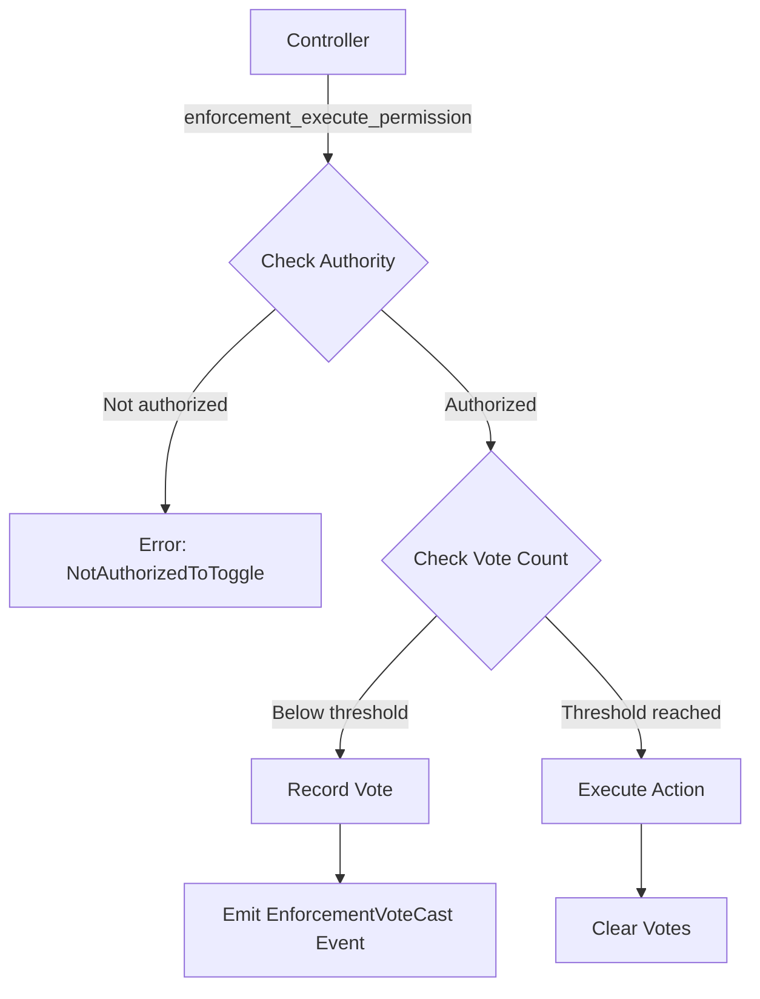
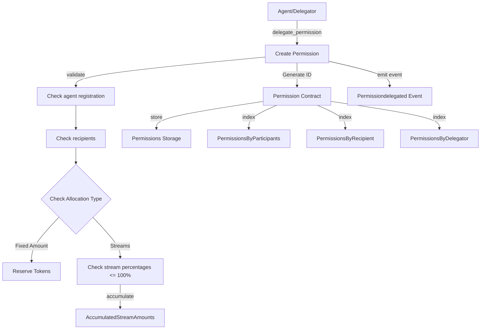
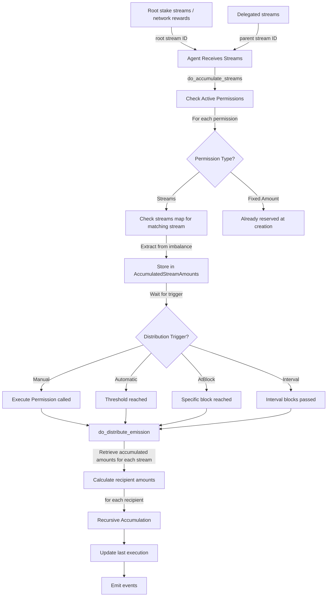

# Permission0: Recursive Stream Delegation

## Overview

Permission0 implements a permission-based delegation system for stream distribution in the Torus network. This pallet enables agents to delegate a portion of their streams to other agents through a structured permission contract framework. Agents can delegate either a percentage of incoming streams or a fixed amount of tokens.

The concept draws inspiration from multi-level competency networks that self-organize for efficient resource allocation. When an agent delegates emissions to another agent, they create economic pathways for token flow, effectively allowing the network to discover and reinforce valuable contributions across different domains.

## Permission Contracts

A permission contract forms the foundation of the delegation relationship. Each contract defines the relationship between a delegator (who delegates emissions) and a recipient (who receives the delegation authority). The contract specifies allocation parameters, distribution controls, duration, and revocation terms.

Permission contracts are identified by a unique `PermissionId` generated deterministically from the delegator, scope, and creation block. This ensures contracts can be consistently referenced and avoids collision issues when multiple contracts exist between the same parties.

```rust
pub struct PermissionContract<T: Config> {
    pub delegator: T::AccountId,
    pub scope: PermissionScope<T>,
    pub duration: PermissionDuration<T>,
    pub revocation: RevocationTerms<T>,
    pub enforcement: EnforcementAuthority<T>,
    pub last_update: BlockNumberFor<T>,
    pub last_execution: Option<BlockNumberFor<T>>,
    pub execution_count: u32,
    pub created_at: BlockNumberFor<T>,
}
```

The contract no longer includes a recipient field at the top level - instead, recipients are defined within each scope type, allowing for more flexible permission structures.

## Permission Scope

The permission contract's scope defines what type of permission it is and how it operates. Currently, the system supports two main permission types:

```rust
pub enum PermissionScope<T: Config> {
    Stream(StreamScope<T>),
    Curator(CuratorScope<T>),
    Namespace(NamespaceScope<T>),
}
```

### Stream Scope

The stream scope defines how streams are allocated and distributed:

```rust
pub struct StreamScope<T: Config> {
    pub recipients: BoundedBTreeMap<T::AccountId, u16, T::MaxRecipientsPerPermission>,
    pub allocation: StreamAllocation<T>,
    pub distribution: DistributionControl<T>,
    pub accumulating: bool,
    pub recipient_managers: BoundedBTreeSet<T::AccountId, T::MaxControllersPerPermission>,
    pub weight_setters: BoundedBTreeSet<T::AccountId, T::MaxControllersPerPermission>,
}
```

The `allocation` field determines how tokens are allocated:

```rust
pub enum StreamAllocation<T: Config> {
    Streams(BoundedBTreeMap<StreamId, Percent, T::MaxStreamsPerPermission>),
    FixedAmount(BalanceOf<T>),
}
```

With `Streams` allocation, portions of the delegator's incoming streams from specific stream sources are diverted according to the percentages specified (0-100%). Each stream ID represents a distinct stream source, allowing for fine-grained control over different stream types. For `FixedAmount` allocation, a specific number of tokens is reserved from the delegator's account at contract creation.

The `recipients` field identifies recipients with associated weights, determining how tokens are distributed among multiple recipients. For example, with recipients A (weight 1) and B (weight 2), recipient B receives twice the tokens of recipient A.

The `recipient_managers` field defines accounts that can manage (add/remove) recipients to this permission's streams. The `weight_setters` field defines accounts that can update the weights of existing recipients.

The `accumulating` boolean determines whether streams should actively accumulate for this permission. This flag can be toggled by the delegator or enforcement authorities to temporarily pause stream accumulation.

### Namespace Scope

The namespace scope defines delegated namespace permissions, allowing for hierarchical delegation of sub-permissions:

```rust
pub struct NamespaceScope<T: Config> {
    pub recipient: T::AccountId,
    pub paths: BoundedBTreeMap<
        Option<PermissionId>,
        BoundedBTreeSet<NamespacePath, T::MaxNamespacesPerPermission>,
        T::MaxNamespacesPerPermission,
    >,
    pub max_instances: u32,
    pub max_children: u32,
}
```

Namespace permissions enable hierarchical delegation trees where permissions can cascade through multiple levels. The `paths` field maps parent permission IDs to sets of namespace paths, enabling complex delegation structures. The `max_instances` and `max_children` fields control how many sub-permissions can be created from this permission.

### Curator Scope

The curator scope defines delegated curator permissions:

```rust
pub struct CuratorScope<T: Config> {
    pub flags: CuratorPermissions,
    pub cooldown: Option<BlockNumberFor<T>>,
}
```

Curator permissions allow governance functions to be delegated to trusted parties, with the available permissions defined as bit flags:

```rust
/// Permission to review and process agent applications
const APPLICATION_REVIEW = 0b0000_0010;
/// Permission to manage the whitelist (add/remove accounts)
const WHITELIST_MANAGE   = 0b0000_0100;
/// Permission to apply penalty factors to agents
const PENALTY_CONTROL    = 0b0000_1000;
```

> `ROOT = 0b0001` exists but is reserved for future use. For now, only the SUDO key is able to delegate curator permissions.

The `cooldown` option provides a rate-limiting mechanism for curator actions.

## Distribution Control

The `distribution` field determines how and when accumulated emissions are distributed:

```rust
pub enum DistributionControl<T: Config> {
    Manual,
    Automatic(BalanceOf<T>),
    AtBlock(BlockNumberFor<T>),
    Interval(BlockNumberFor<T>),
}
```

The distribution control mechanism provides flexibility in how emissions flow through the network:

- `Manual`: The recipient must explicitly call `execute_permission` to trigger distribution
- `Automatic`: Distribution occurs when accumulated amount reaches the specified threshold
- `AtBlock`: Distribution triggers at a specific block number
- `Interval`: Distribution occurs periodically at the specified block interval

## Permission Duration and Revocation

Permissions can have different durations:

```rust
pub enum PermissionDuration<T: Config> {
    UntilBlock(BlockNumberFor<T>),
    Indefinite,
}
```

This allows for temporary delegations (`UntilBlock`) or permanent ones (`Indefinite`). Expired permissions are automatically removed during the regular block processing.

Revocation terms define how a permission can be revoked before its normal expiration:

```rust
pub enum RevocationTerms<T: Config> {
    Irrevocable,
    RevocableByDelegator,
    RevocableByArbiters {
        accounts: BoundedVec<T::AccountId, T::MaxRevokersPerPermission>,
        required_votes: u32,
    },
    RevocableAfter(BlockNumberFor<T>),
}
```

These terms create different security guarantees for the recipient, ranging from complete assurance (`Irrevocable`) to flexible arrangements (`RevocableByDelegator`). The `RevocableByArbiters` option allows for multi-signature revocation by designated third parties. The recipient can ALWAYS revoke a permission as it is the one being benefitted.

## Enforcement Authority System

The permission system includes a powerful mechanism for third-party governance through the `EnforcementAuthority` type. This allows designated controllers to oversee permissions based on off-chain constraints and conditions.

```rust
pub enum EnforcementAuthority<T: Config> {
    None,
    ControlledBy {
        controllers: BoundedVec<T::AccountId, T::MaxControllersPerPermission>,
        required_votes: u32,
    },
}
```

The enforcement authority system creates a bridge between on-chain permissions and off-chain verification. Controllers can collectively approve or reject actions based on information that might not be directly encodable in the chain state.

### Enforcement Actions

Controllers can perform two primary actions:

1. **Toggle accumulation** - Enable or disable the accumulation of emissions for a permission
2. **Force execution** - Trigger permission execution regardless of normal distribution parameters

Both actions support multi-signature governance through a voting mechanism. When a controller initiates an action, it's recorded as a vote in the `EnforcementTracking` storage:

```rust
pub type EnforcementTracking<T: Config> = StorageDoubleMap<
    _,
    Identity,
    PermissionId,
    Identity,
    EnforcementReferendum,
    BoundedBTreeSet<T::AccountId, T::MaxControllersPerPermission>,
    ValueQuery,
>;
```

The action only proceeds when the number of votes reaches the required threshold. This creates a secure governance layer where multiple parties must agree before a permission's state can be modified.

### Voting Process



The controller's vote is stored and counted toward the threshold. If more votes are needed, the action is deferred and an `EnforcementVoteCast` event is emitted. When enough votes accumulate, the action executes automatically and all votes for that action are cleared.

### Practical Applications

This mechanism enables several real-world scenarios:

- Compliance verification by a committee before allowing distributions
- Performance-based controls where emissions depend on off-chain metrics
- Dispute resolution processes with trusted arbiters
- Emergency circuit breakers for security incidents
- Complex contractual conditions that can't be fully encoded on-chain

For example, a permission might require KYC verification before distributions can proceed. While the verification happens off-chain, the enforcement authority ensures that only properly verified permissions can execute on-chain.

### Setting Up Enforcement

Enforcement can be configured in two ways:

1. During permission creation via the `delegate_stream_permission` extrinsic
2. After creation through the `set_enforcement_authority` extrinsic (only by the delegator or root)

```rust
pub fn set_enforcement_authority(
    origin: OriginFor<T>,
    permission_id: PermissionId,
    controllers: Vec<T::AccountId>,
    required_votes: u32,
) -> DispatchResult
```

The voting threshold can be adjusted to match security requirements - higher thresholds for more sensitive permissions, lower thresholds for operational flexibility.

The enforcement authority system transforms the permission framework from a simple delegation tool into a sophisticated governance mechanism that bridges on-chain and off-chain worlds, enabling complex business relationships to be represented and enforced through the blockchain.

## Extrinsics

The Permission0 pallet provides several extrinsics to manage the permission lifecycle:

### delegate_stream_permission

```rust
pub fn delegate_stream_permission(
    origin: OriginFor<T>,
    recipients: Vec<(T::AccountId, u16)>,
    allocation: StreamAllocation<T>,
    distribution: DistributionControl<T>,
    duration: PermissionDuration<T>,
    revocation: RevocationTerms<T>,
    enforcement: EnforcementAuthority<T>,
    recipient_manager: Option<T::AccountId>,
    weight_setter: Option<T::AccountId>,
) -> DispatchResult
```

Creates a new stream permission from the signed origin. The caller must be a registered agent, as must all recipients. Checks for valid allocation percentages, ensuring the total allocated percentage doesn't exceed 100% per stream.

### delegate_curator_permission

```rust
pub fn delegate_curator_permission(
    origin: OriginFor<T>,
    recipient: T::AccountId,
    flags: u32,
    cooldown: Option<BlockNumberFor<T>>,
    duration: PermissionDuration<T>,
    revocation: RevocationTerms<T>,
) -> DispatchResult
```

Creates a new curator permission, but can only be called with the Root origin. The `flags` parameter is a bitwise combination of curator permissions (APPLICATION_REVIEW, WHITELIST_MANAGE, PENALTY_CONTROL). The ROOT permission cannot be delegated.

Only one curator permission can exist per recipient - attempting to create a second will result in a `DuplicatePermission` error. The optional `cooldown` parameter enforces a delay between successive uses of the permission.

### revoke_permission

```rust
pub fn revoke_permission(
    origin: OriginFor<T>,
    permission_id: PermissionId,
) -> DispatchResult
```

Revokes the specified permission if the caller meets the permission's revocation terms. This can be:

- The recipient (always allowed)
- The delegator (if RevocableByDelegator)
- Root origin (always allowed)
- Designated arbiters (with sufficient votes for RevocableByArbiters)
- Anyone, after the specified block (for RevocableAfter)

For RevocableByArbiters, votes are collected in the RevocationTracking storage until the required threshold is reached.

### execute_permission

```rust
pub fn execute_permission(
    origin: OriginFor<T>,
    permission_id: PermissionId,
) -> DispatchResult
```

Manually executes a permission with distribution control set to Manual. For stream permissions, this distributes accumulated tokens to the recipients according to their weights. Can only be called by the delegator or root.

### toggle_permission_accumulation

```rust
pub fn toggle_permission_accumulation(
    origin: OriginFor<T>,
    permission_id: PermissionId,
    accumulating: bool,
) -> DispatchResult
```

Enables or disables accumulation for a stream permission. Can be called by the delegator, root, or enforcement controllers (with sufficient votes).

### enforcement_execute_permission

```rust
pub fn enforcement_execute_permission(
    origin: OriginFor<T>,
    permission_id: PermissionId,
) -> DispatchResult
```

Executes a permission through the enforcement authority mechanism. Requires sufficient votes from the designated controllers unless called by root.

### set_enforcement_authority

```rust
pub fn set_enforcement_authority(
    origin: OriginFor<T>,
    permission_id: PermissionId,
    controllers: Vec<T::AccountId>,
    required_votes: u32,
) -> DispatchResult
```

Sets or updates the enforcement authority for a permission. Can only be called by the delegator or root. The controllers and required_votes must form a valid multi-signature configuration (non-empty controllers, required_votes > 0, required_votes <= controllers.len()).

### delegate_namespace_permission

```rust
pub fn delegate_namespace_permission(
    origin: OriginFor<T>,
    recipient: T::AccountId,
    paths: Vec<(Option<PermissionId>, Vec<NamespacePath>)>,
    max_instances: u32,
    max_children: u32,
    duration: PermissionDuration<T>,
    revocation: RevocationTerms<T>,
) -> DispatchResult
```

Creates a new namespace permission from the signed origin to the specified recipient. Allows delegation of namespace paths with configurable limits on sub-permission creation.

### batch_delegate_namespace_permission

```rust
pub fn batch_delegate_namespace_permission(
    origin: OriginFor<T>,
    recipients: Vec<T::AccountId>,
    paths: Vec<(Option<PermissionId>, Vec<NamespacePath>)>,
    max_instances: u32,
    max_children: u32,
    duration: PermissionDuration<T>,
    revocation: RevocationTerms<T>,
) -> DispatchResult
```

Batch creates multiple namespace permissions with the same properties but different recipients. This is more efficient than creating permissions individually.

### update_stream_permission

```rust
pub fn update_stream_permission(
    origin: OriginFor<T>,
    permission_id: PermissionId,
    recipients: Option<Vec<(T::AccountId, u16)>>,
    accumulating: Option<bool>,
    recipient_manager: Option<T::AccountId>,
    weight_setter: Option<T::AccountId>,
) -> DispatchResult
```

Allows delegator or authorized accounts to update stream permission properties, including recipients, accumulation state, and management roles.

### update_namespace_permission

```rust
pub fn update_namespace_permission(
    origin: OriginFor<T>,
    permission_id: PermissionId,
    max_instances: Option<u32>,
    max_children: Option<u32>,
) -> DispatchResult
```

Allows a delegator to update the instance and children limits of a namespace permission.

## Permission Creation



## Stream Accumulation and Distribution Process



When an agent receives streams, the pallet intercepts a portion based on active permission contracts through the `do_accumulate_streams` function. The accumulated amounts are stored in the `AccumulatedStreamAmounts` storage map until distribution conditions are met.

The function is designed to be highly efficient, with a storage structure optimized for quick lookup of all permissions associated with a specific (agent, stream) pair:

```rust
fn do_accumulate_streams<T: Config>(
    agent: &T::AccountId,
    stream: &StreamId,
    imbalance: &mut <T::Currency as Currency<T::AccountId>>::NegativeImbalance,
) {
    // Get all permissions for this agent and stream
    let streams = AccumulatedStreamAmounts::<T>::iter_prefix((agent, stream));

    // Process each permission
    for (permission_id, balance) in streams {
        // Calculate and accumulate based on stream percentage
        // ...
    }
}
```

During distribution (`do_distribute_stream`), the accumulated amount for each stream is divided among recipients according to their weights. The distribution uses the `Currency` trait to handle token movement between accounts.

Importantly, the recursive accumulation does not happen in the same block to prevent unbounded recursion and excessive computation. Instead, when a recipient receives their portion, it becomes a regular imbalance that will trigger the standard accumulation process in the next applicable block.

## Storage Design

The Permission0 pallet uses several storage maps to track permissions and accumulated amounts:

```rust
pub type Permissions<T: Config> = StorageMap<_, Identity, PermissionId, PermissionContract<T>>;
pub type PermissionsByParticipants<T: Config> = StorageMap<_, Identity, (T::AccountId, T::AccountId), BoundedVec<PermissionId, T::MaxRecipientsPerPermission>>;
pub type PermissionsByDelegator<T: Config> = StorageMap<_, Identity, T::AccountId, BoundedVec<PermissionId, T::MaxRecipientsPerPermission>>;
pub type PermissionsByRecipient<T: Config> = StorageMap<_, Identity, T::AccountId, BoundedVec<PermissionId, T::MaxRecipientsPerPermission>>;
pub type AccumulatedStreamAmounts<T: Config> = StorageNMap<
    _,
    (
        NMapKey<Identity, T::AccountId>,
        NMapKey<Identity, StreamId>,
        NMapKey<Identity, PermissionId>,
    ),
    BalanceOf<T>,
>;
```

This storage design allows efficient lookups for:

- Finding all permissions between specific parties
- Retrieving all permissions delegated by an account
- Retrieving all permissions received by an account
- Tracking accumulated tokens for each permission by stream

The `AccumulatedStreamAmounts` uses a StorageNMap with a triple key of (AccountId, StreamId, PermissionId). This structure was chosen for performance reasons, as the `do_accumulate_streams` function is called frequently and needs to quickly find all permissions associated with a specific account and stream combination. The order of the keys prioritizes searching by account and stream first, which is the most common access pattern.

## Stream-based Model

The permission system uses a stream-based approach for tracking different sources of streams:

```rust
pub type StreamId = H256;
```

Each stream is identified by a unique `StreamId`, which represents a specific source of streams. The system distinguishes between different types of streams, each representing a distinct source.

When streams are redelegated through the permission system, their IDs are preserved. This crucial design choice allows for tracking the lineage and flow of streams throughout the network, making it possible to trace the complete path of tokens from their source to final recipients across multiple delegation hops.

This stream-based model allows for much more granular control over stream delegation, enabling agents to specify different delegation percentages for different types of streams they receive.

## Integration with Stream Distribution

Permission0 integrates with the `Emission0` pallet by intercepting the stream distribution process. When the linear rewards mechanism distributes tokens, the `do_accumulate_streams` function is called to divert portions according to active permissions.

This integration preserves the existing stream calculation logic while adding the delegation layer on top. The approach ensures delegations only affect how already-calculated streams are distributed, rather than altering the stream calculations themselves.

## Automatic Processing

The pallet implements the `on_finalize` hook to handle periodic tasks:

```rust
fn on_finalize(block_number: BlockNumberFor<T>) {
    permission::do_auto_permission_execution::<T>(block_number);
}
```

The `do_auto_permission_execution` function processes permissions when `current_block % 10 == 0` (i.e., every 10 blocks) to:

1. Check for and execute automatic distributions
2. Check for and execute interval-based distributions
3. Check for and execute at-block distributions
4. Remove expired permissions

This mechanism ensures automatic processes happen regularly without requiring manual intervention.

## Configuration

The pallet is customizable through several configuration parameters:

```rust
type MaxRecipientsPerPermission: Get<u32>;
type MaxStreamsPerPermission: Get<u32>;
type MaxRevokersPerPermission: Get<u32>;
type MaxControllersPerPermission: Get<u32>;
type MinAutoDistributionThreshold: Get<BalanceOf<Self>>;
```

These parameters control storage limits and processing intervals, allowing the network to balance functionality against resource usage.

## Historical Context

Permission0 emerged from the need to create more sophisticated economic relationships in the Torus network. The initial concept was described as:

_"A distributed multi-level search process for new competencies, methods and organizational forms that can serve the respective higher level competitively, such that it can serve the level above better too, cascading upwards each delegation tree."_

The implementation allows economic signals (in the form of streams) to flow through the network according to agent decisions, creating a dynamic feedback mechanism that rewards valuable contributions at all levels.

A crucial insight was that rational agents will redelegate streams when doing so increases their own streams by more than they delegate. This positive-sum logic creates natural incentives for delegation trees to form and adapt over time.

## Practical Applications

The permission-based delegation system enables several practical scenarios:

1. Validators can delegate a percentage of streams to miners who provide specialized services
2. Module operators can share streams with agents who contribute to their module
3. Teams can create token distribution trees that align with organizational structures
4. Specialized agents can emerge to discover and connect valuable contributors

The flexible distribution controls accommodate different time horizons and trust relationships, from immediate rewards to long-term alignments.

Crucially, the recursive nature of permissions means delegation trees can extend to arbitrary depth, allowing for complex specialization hierarchies to emerge organically.

## Safety Mechanisms

By using the `Currency` trait, we are able to use reserves for fixed amount streams, and negative imbalances to avoid emitting duplicate tokens. This is a core part of safety.

Additionally, recursive accumulation is designed to prevent infinite loops by deferring lower-level accumulation to subsequent blocks.

## Future Development

While the current implementation focuses on stream delegation, the permission framework could extend to other domains like governance rights, data access, or identity verification. The modular design allows new permission scopes to be added without disrupting existing functionality.
