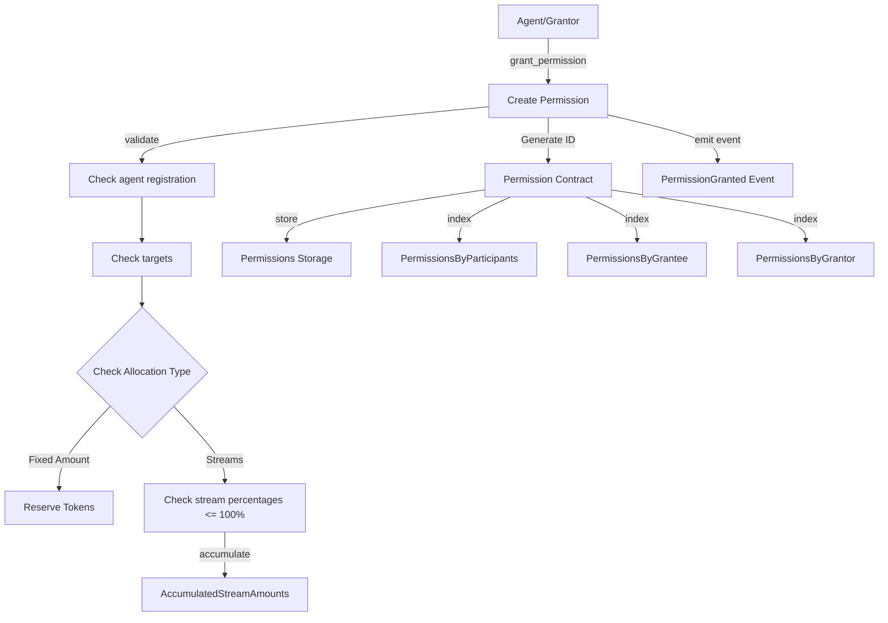

# Permission0: Recursive Emission Delegation

## Overview

Permission0 implements a permission-based delegation system for emission distribution in the Torus network. This pallet enables agents to delegate a portion of their emissions to other agents through a structured permission contract framework. Agents can delegate either a percentage of incoming emissions or a fixed amount of tokens.

The concept draws inspiration from multi-level competency networks that self-organize for efficient resource allocation. When an agent delegates emissions to another agent, they create economic pathways for token flow, effectively allowing the network to discover and reinforce valuable contributions across different domains.

## Permission Contracts

A permission contract forms the foundation of the delegation relationship. Each contract defines the relationship between a grantor (who delegates emissions) and a grantee (who receives the delegation authority). The contract specifies allocation parameters, distribution controls, duration, and revocation terms.

Permission contracts are identified by a unique `PermissionId` generated deterministically from the grantor, grantee, scope, and creation block. This ensures contracts can be consistently referenced and avoids collision issues when multiple contracts exist between the same parties.

```rust
pub struct PermissionContract<T: Config> {
    pub grantor: T::AccountId,
    pub grantee: T::AccountId,
    pub scope: PermissionScope<T>,
    pub duration: PermissionDuration<T>,
    pub revocation: RevocationTerms<T>,
    pub last_execution: Option<BlockNumberFor<T>>,
    pub execution_count: u32,
    pub parent: Option<PermissionId>,
    pub created_at: BlockNumberFor<T>,
}
```

The `parent` field enables recursive delegation chains, where a permission can be derived from a higher-level permission. This creates hierarchical delegation trees where permissions can cascade through multiple levels of delegation.

## Emission Allocation

The permission contract's scope defines how emissions are allocated. The current implementation supports only emission-type permissions through the `EmissionScope` structure:

```rust
pub struct EmissionScope<T: Config> {
    pub allocation: EmissionAllocation<T>,
    pub distribution: DistributionControl<T>,
    pub targets: BoundedBTreeMap<T::AccountId, u16, T::MaxTargetsPerPermission>,
}
```

The `allocation` field determines how tokens are allocated:

```rust
pub enum EmissionAllocation<T: Config> {
    Streams(BoundedBTreeMap<StreamId, Percent, T::MaxTargetsPerPermission>),
    FixedAmount(BalanceOf<T>),
}
```

With `Streams` allocation, portions of the grantor's incoming emissions from specific streams are diverted according to the percentages specified (0-100%). Each stream ID represents a distinct emission source, allowing for fine-grained control over different emission types. For `FixedAmount` allocation, a specific number of tokens is reserved from the grantor's account at contract creation.

The `targets` field identifies recipients with associated weights, determining how tokens are distributed among multiple targets. For example, with targets A (weight 1) and B (weight 2), target B receives twice the tokens of target A.

## Distribution Control

The `distribution` field determines how and when accumulated emissions are distributed:

```rust
pub enum DistributionControl<T: Config> {
    Manual,
    Automatic(BalanceOf<T>),
    AtBlock(BlockNumberFor<T>),
    Interval(BlockNumberFor<T>),
}
```

The distribution control mechanism provides flexibility in how emissions flow through the network:

- `Manual`: The grantee must explicitly call `execute_permission` to trigger distribution
- `Automatic`: Distribution occurs when accumulated amount reaches the specified threshold
- `AtBlock`: Distribution triggers at a specific block number
- `Interval`: Distribution occurs periodically at the specified block interval

## Permission Duration and Revocation

Permissions can have different durations:

```rust
pub enum PermissionDuration<T: Config> {
    Blocks(BlockNumberFor<T>),
    UntilBlock(BlockNumberFor<T>),
    Indefinite,
}
```

This allows for temporary delegations (`Blocks`, `UntilBlock`) or permanent ones (`Indefinite`). Expired permissions are automatically removed during the regular block processing.

Revocation terms define how a permission can be revoked before its normal expiration:

```rust
pub enum RevocationTerms<T: Config> {
    Irrevocable,
    RevocableByGrantor,
    RevocableByArbiters(BoundedVec<T::AccountId, T::MaxArbitersPerPermission>),
    AfterBlock(BlockNumberFor<T>),
}
```

These terms create different security guarantees for the grantee, ranging from complete assurance (`Irrevocable`) to flexible arrangements (`RevocableByGrantor`). The grantee can ALWAYS revoke a permission as it is the one being benefitted.

## Permission creation

A new permission is created through the `grant_permission` extrinsic.



## Emission Accumulation and Distribution Process


When an agent receives emissions, the pallet intercepts a portion based on active permission contracts through the `do_accumulate_emissions` function. The accumulated amounts are stored in the `AccumulatedStreamAmounts` storage map until distribution conditions are met.

The function is designed to be highly efficient, with a storage structure optimized for quick lookup of all permissions associated with a specific (agent, stream) pair:

```rust
fn do_accumulate_emissions<T: Config>(
    agent: &T::AccountId,
    stream: &StreamId,
    imbalance: &mut <T::Currency as Currency<T::AccountId>>::NegativeImbalance,
) {
    // Get all permissions for this agent and stream
    let streams = AccumulatedStreamAmounts::<T>::iter_prefix((agent, stream));

    // Process each permission
    for (permission_id, balance) in streams {
        // Calculate and accumulate based on stream percentage
        // ...
    }
}
```

During distribution (`do_distribute_emission`), the accumulated amount for each stream is divided among targets according to their weights. The distribution uses the `Currency` trait to handle token movement between accounts.

Importantly, the recursive accumulation does not happen in the same block to prevent unbounded recursion and excessive computation. Instead, when a target receives their portion, it becomes a regular imbalance that will trigger the standard accumulation process in the next applicable block.

## Storage Design

The Permission0 pallet uses several storage maps to track permissions and accumulated amounts:

```rust
pub type Permissions<T: Config> = StorageMap<_, Identity, PermissionId, PermissionContract<T>>;
pub type PermissionsByParticipants<T: Config> = StorageMap<_, Identity, (T::AccountId, T::AccountId), BoundedVec<PermissionId, T::MaxTargetsPerPermission>>;
pub type PermissionsByGrantor<T: Config> = StorageMap<_, Identity, T::AccountId, BoundedVec<PermissionId, T::MaxTargetsPerPermission>>;
pub type PermissionsByGrantee<T: Config> = StorageMap<_, Identity, T::AccountId, BoundedVec<PermissionId, T::MaxTargetsPerPermission>>;
pub type AccumulatedStreamAmounts<T: Config> = StorageNMap<
    _,
    (
        NMapKey<Identity, T::AccountId>,
        NMapKey<Identity, StreamId>,
        NMapKey<Identity, PermissionId>,
    ),
    BalanceOf<T>,
>;
```

This storage design allows efficient lookups for:

- Finding all permissions between specific parties
- Retrieving all permissions granted by an account
- Retrieving all permissions received by an account
- Tracking accumulated tokens for each permission by stream

The `AccumulatedStreamAmounts` uses a StorageNMap with a triple key of (AccountId, StreamId, PermissionId). This structure was chosen for performance reasons, as the `do_accumulate_emissions` function is called frequently and needs to quickly find all permissions associated with a specific account and stream combination. The order of the keys prioritizes searching by account and stream first, which is the most common access pattern.

## Stream-based Emission Model

The permission system uses a stream-based approach for tracking different sources of emissions:

```rust
pub type StreamId = H256;
```

Each stream is identified by a unique `StreamId`, which represents a specific source of emissions. The system distinguishes between:

1. **Root Streams**: Generated for each agent using a deterministic function. These are the primary emission streams that agents receive directly.

```rust
pub fn generate_root_stream_id<AccountId: Encode>(agent_id: &AccountId) -> StreamId {
    let mut data = ROOT_STREAM_PREFIX.to_vec();
    data.extend(agent_id.encode());
    blake2_256(&data).into()
}
```

2. **Derived Streams**: Generated when emissions flow through permissions, allowing for tracking of emission pathways through the network.

When streams are redelegated through the permission system, their IDs are preserved rather than generating new ones. This crucial design choice allows for easy tracking of the lineage and flow of emissions throughout the network, making it possible to trace the complete path of tokens from their source to final recipients across multiple delegation hops.

This stream-based model allows for much more granular control over emission delegation, enabling agents to specify different delegation percentages for different types of emission streams they receive.

## Integration with Emission Distribution

Permission0 integrates with the `Emission0` pallet by intercepting the emission distribution process. When the linear rewards mechanism distributes tokens, the `do_accumulate_emissions` function is called to divert portions according to active permissions.

This integration preserves the existing emission calculation logic while adding the delegation layer on top. The approach ensures delegations only affect how already-calculated emissions are distributed, rather than altering the emission calculations themselves.

## Automatic Processing

The pallet implements the `on_finalize` hook to handle periodic tasks:

```rust
fn on_finalize(block_number: BlockNumberFor<T>) {
    // Process automatic distributions every 10 blocks
    if (block_number % 10).is_zero() {
        Self::do_auto_permission_execution(block_number);
    }
}
```

The `do_auto_permission_execution` function processes all permissions to:

1. Check for and execute automatic distributions
2. Check for and execute interval-based distributions
3. Check for and execute at-block distributions
4. Remove expired permissions

This mechanism ensures automatic processes happen regularly without requiring manual intervention.

## Configuration

The pallet is customizable through several configuration parameters:

```rust
type MaxTargetsPerPermission: Get<u32>;
type MaxArbitersPerPermission: Get<u32>;
```

These parameters control storage limits and processing intervals, allowing the network to balance functionality against resource usage.

## Historical Context

Permission0 emerged from the need to create more sophisticated economic relationships in the Torus network. The initial concept was described as:

_"A distributed multi-level search process for new competencies, methods and organizational forms that can serve the respective higher level competitively, such that it can serve the level above better too, cascading upwards each delegation tree."_

The implementation allows economic signals (in the form of emissions) to flow through the network according to agent decisions, creating a dynamic feedback mechanism that rewards valuable contributions at all levels.

A crucial insight was that rational agents will redelegate emissions when doing so increases their own emissions by more than they delegate. This positive-sum logic creates natural incentives for delegation trees to form and adapt over time.

## Practical Applications

The permission-based delegation system enables several practical scenarios:

1. Validators can delegate a percentage of emissions to miners who provide specialized services
2. Module operators can share emissions with agents who contribute to their module
3. Teams can create token distribution trees that align with organizational structures
4. Specialized agents can emerge to discover and connect valuable contributors

The flexible distribution controls accommodate different time horizons and trust relationships, from immediate rewards to long-term alignments.

Crucially, the recursive nature of permissions means delegation trees can extend to arbitrary depth, allowing for complex specialization hierarchies to emerge organically.

## Safety Mechanisms

By using the `Currency` trait, we are able to use reserves for fixed amount emissions, and negative imbalances to avoid emitting duplicate tokens. This is a core part of safety.

Additionally, recursive accumulation is designed to prevent infinite loops by deferring lower-level accumulation to subsequent blocks.

## Future Development

While the current implementation focuses on emission delegation, the permission framework could extend to other domains like governance rights, data access, or identity verification. The modular design allows new permission scopes to be added without disrupting existing functionality.
